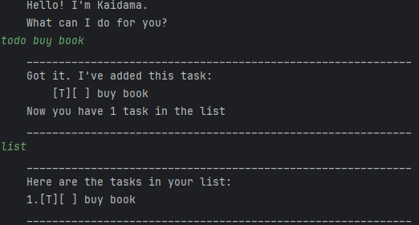

# ui.Kaidama User Guide




## Adding deadlines


input: deadline  

```
output:
____________________________________________________________
Got it. I've added this task:
[D][ ] return books (by: Sunday)
Now you have 2 task in the list
____________________________________________________________
```


## Mark task as completed
input: mark 1
```angular2html
output:
    ____________________________________________________________
    Nice! I've marked this task as done:
        [D][X] buy books (by: Jan 4th)
    ____________________________________________________________

```
   
