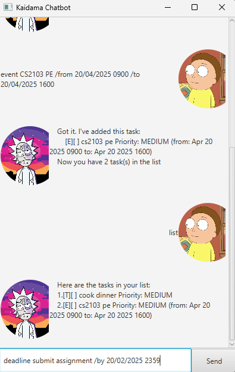

# Kaidama User Guide

Kaidama is a Personal Assistant Chatbot that helps users keep track of various thing using the
Command Line Interface (CLI)
---
## Table of Contents
- [Add Todo](#add-todo)
- [Add Deadline](#add-deadline)
- [Add Event](#add-event)
- [Mark Task](#mark-task)
- [Unmark Task](#unmark-task)
- [List Tasks](#list-tasks)
- [Delete Task](#delete-task)
- [Find Task](#find-task)
- [Set Priority](#set-priority)
- [Exit](#exit)
- [Save Data to Text File](#save-data)
- [Acknowledgements](#Acknowledgements)
- [Command Summary](#Command-Summary)

---

## Add Todo
To add a new task without a deadline or event, use the following format:

**Format:**  
`todo <DESCRIPTION>`

**Example:**  
`todo read book`

---

## Add Deadline
To add a task with a deadline, use this format:

**Format:**  
`deadline <DESCRIPTION> /by <DATE>`

**Example:**  
`deadline Submit assignment /by 20/02/2025 2359`

---

## Add Event
To add an event that spans a period of time:

**Format:**  
`event <DESCRIPTION> /from <START DATE> /to <END DATE>`

**Example:**  
`event Project meeting /from 20/02/2025 0800 /to 20/02/2025 2359`

---

## Mark Task
To mark a task as completed:

**Format:**  
`mark <TASK NUMBER>`

**Example:**  
`mark 1`

---

## Unmark Task
To unmark a completed task:

**Format:**  
`unmark <TASK NUMBER>`

**Example:**  
`unmark 1`

---

## List Tasks
To view all tasks:

**Format:**  
`list`

---

## Delete Task
To delete a specific task:

**Format:**  
`delete <task number>`

**Example:**  
`delete 2`

---

## Find Task
To search for tasks that contain a specific keyword:

**Format:**  
`find [keyword]`

**Example:**  
`find books`

This will return all tasks containing the word "books"

---

## Set Priority
To set a priority level for a task:

**Format:**  
`set priority [task number] [priority level]`

Priority levels: `high`, `medium`, `low`

**Example:**  
`set priority 3 high`

---

## Exit
To exit the program:

**Format:**  
`bye`

---

## Save Data
Task list data are saved automatically as a TXT file `[JAR file location]/data/kaidama.txt`.
Advanced users are welcome to update data directly by editing that data file.

❗**Caution**: If your changes to the data file makes its format invalid, 
Kaidama will return an error parsing data. 
Hence, it is recommended to take a backup of the file before editing it. 
Edit the data file only if you are confident that you can update it correctly.

---

# Acknowledgements

---
Some of the JavaDocs comments were generated with ChatGPT and DeepSeek.
Command Summary in README.md is generated with ChatGPT.

---

# Command Summary

| **Action**       | **Format, Examples**                                                                 |
|-------------------|-------------------------------------------------------------------------------------|
| **Add Todo**      | `todo <DESCRIPTION>`   e.g., `todo Buy groceries`                                |
| **Add Deadline**  | `deadline <DESCRIPTION> /by <DATE>`   e.g., `deadline Submit assignment /by 20/02/2025 2359` |
| **Add Event**     | `event <DESCRIPTION> /from <START DATE> /to <END DATE>`   e.g., `event Project meeting /from 22/02/2025 /to 23/02/2025` |
| **Mark Task**     | `mark <TASK NUMBER>`   e.g., `mark 1`                                           |
| **Unmark Task**   | `unmark <TASK NUMBER>`   e.g., `unmark 1`                                       |
| **List Tasks**    | `list`                                                                             |
| **Delete Task**   | `delete <TASK NUMBER>`   e.g., `delete 2`                                       |
| **Find Task**     | `find <KEYWORD>`   e.g., `find books`                                           |
| **Set Priority**  | `set priority <TASK NUMBER> <PRIORITY LEVEL>`   e.g., `set priority 3 high`     |
| **Exit**          | `bye`                                                                              |
| **Save Data**     | Data is automatically saved to a text file.                                        |